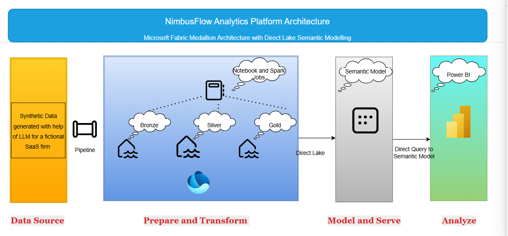

# Project Polaris

## Enterprise Analytics Platform on Microsoft Fabric

Project Polaris is an end-to-end analytics engineering case study built using Microsoft Fabric for **NimbusFlow**, a fictional SaaS workflow automation company.

The platform combines subscription revenue, customer data and product-usage activity into a governed analytical solution using OneLake, Lakehouse architecture, Delta tables, PySpark notebooks, Data Factory pipelines, Direct Lake and Power BI.

All data used in this project is synthetic. The project contains no employer, customer or production data.

---

## Business Scenario

NimbusFlow provides workflow automation and API integration services through monthly subscription plans.

Its data is distributed across separate operational domains:

- Customer and account information
- Subscription billing
- Product usage
- Plan and pricing information

This creates inconsistent definitions of recurring revenue, customer growth, churn and product adoption.

Project Polaris was designed to provide a trusted analytical platform for answering questions such as:

- How is monthly recurring revenue changing?
- What is driving MRR growth or contraction?
- Which customers are using the platform most heavily?
- Which customers are showing signs of disengagement?
- How much recurring revenue is associated with at-risk customers?

---

## Solution Architecture

The platform follows a medallion architecture:

        ↓
Power BI Reports

All data used in this project is synthetic 
