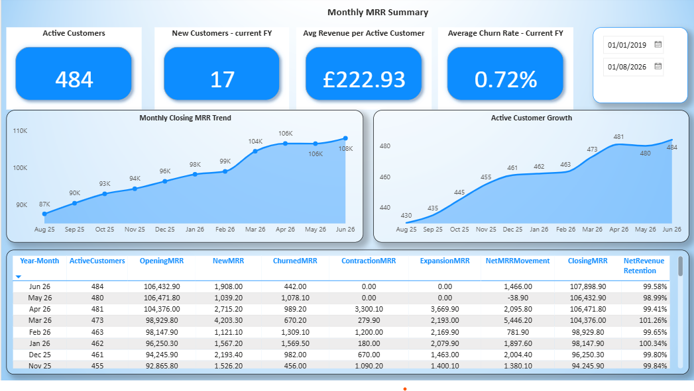
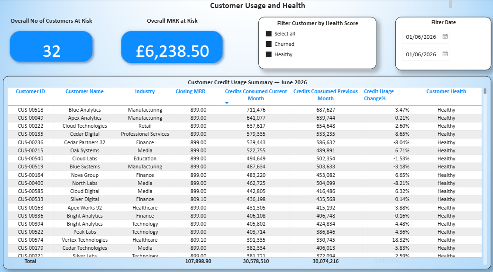
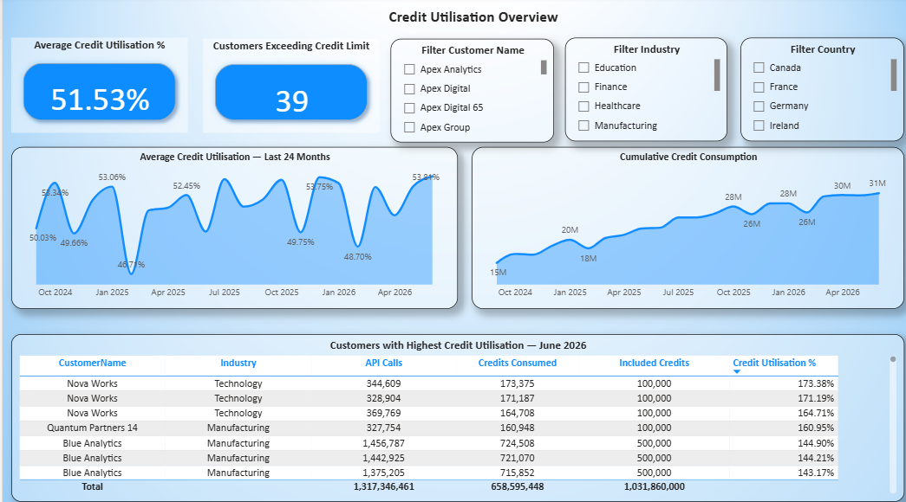

# Power BI Report

The NimbusFlow Power BI report is built on the `SM POL EXECUTIVE`
semantic model and presents subscription, customer health and product
usage insights.

## Report Pages

### 1. Executive Summary

### 2. Customer Health

### 3. Product Usage Analysis

